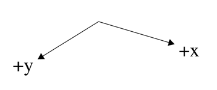

# Demostraciones matemáticas
## Transformación Isométrica
Sea el vector $\vec{r}=\langle x,y,z\rangle\in\mathbb{R}^3$ representante
de la posición en las "coordenadas de simulación". El vector
$\vec{r}'=\langle u, v\rangle\in\mathbb{R}^2$ representa las "coordenadas
de pantalla".

**Teo.** Para transformar de $\vec{r}$ a $\vec{r}'$ se utiliza la siguiente
matriz de transformación
$$
\Xi = s\begin{bmatrix}
1 & -1 & 0\\
\frac{1}{2} & \frac{1}{2} & -1
\end{bmatrix}
$$
donde $s$ es la escala de la transformación. Así, la posición en pantalla está dada por
$$\begin{bmatrix} u \\ v \end{bmatrix}=\Xi
\begin{bmatrix} x \\ y \\ z \end{bmatrix}+\begin{bmatrix} u_0 \\ v_0 \end{bmatrix}
$$
siendo este último vector el _offset_.

**Teo.** La transformación inversa se hace a través del siguiente sistema de ecuaciones,
asumiendo una $z$ dada
$$
\begin{cases}
x &= \frac{1}{s}\Big(v-v_0+z+\frac{u-u_0}{2}\Big)\\
y &= \frac{1}{s}\Big(v-v_0+z-\frac{u-u_0}{2}\Big)
\end{cases}
$$
**Def.** Diagrama de coordenadas

## Cinemática del sistema
Si la energía potencial está dada por
$$V=mgz$$
entonces la aceleración del sistema es
$$\ddot{r}=\frac{1}{m}\nabla V$$
y así
$$\vec{r}=\frac{1}{m}\iint\nabla V\text{d}^2t$$
De esta forma, llegamos a la expresión vectorial del movimiento
$$\vec{r}=\begin{bmatrix}
v_xt+x_1\\ v_yt+y_1\\ \frac{1}{2}gt^2+v_yt+z_1
\end{bmatrix}$$

Si hacemos $\vec{a}=\langle 0,0,\frac{1}{2}g\rangle$, $\vec{v}=\langle v_x, v_y, v_z\rangle$ y
$\vec{r}_1=\langle x_1, y_1, z_1\rangle$ podemos condensarlo en la forma
$$\vec{r}=\vec{a}t^2+\vec{v}t+\vec{r}_1$$

## Reglas de creación de mapas
Los mapas se hacen con Tiled y se dividen en capas:
- z0: La primera capa es el suelo, lleva el nombre de "z0".
En esta capa no se deben colocar bloques en las filas x=0 o y=0.
- z1, z2, z3: Corresponden a las siguientes alturas
